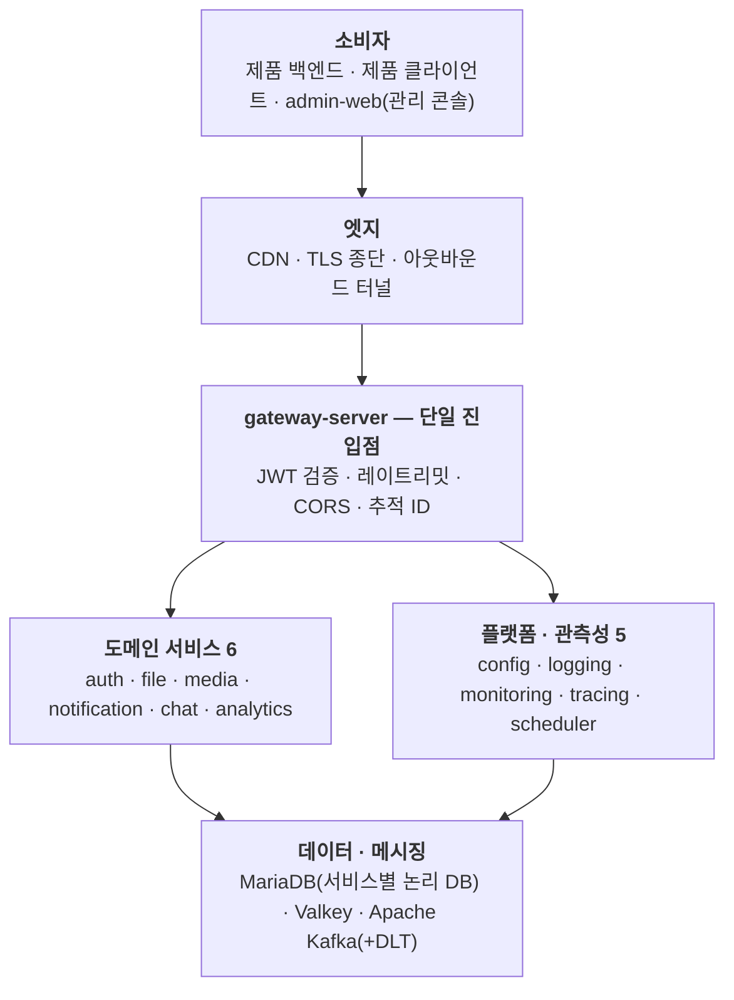

# SSW Infra

**Shared backend infrastructure that multiple products plug into — one gateway, contract-first, event-driven.**

여러 제품이 각자 인증·파일·알림·로그를 다시 만들지 않도록, **한 번 만들어 공용으로 쓰는 백엔드
인프라**입니다. 새 제품의 온보딩은 원칙적으로 "테넌트 등록 + 토큰 발급"으로 끝나야 한다는 목표를
설계 기준으로 삼았습니다.

- **규모**: 17개 모듈 / 5개 그룹 (도메인 서비스 · 플랫폼 · 클라이언트 · 공용 계약 라이브러리 · 운영 기반)
- **성격**: 특정 제품 전용이 아닌 **제품 불가지론(product-agnostic) 플랫폼**. 현재 이커머스 데모
  프로젝트가 첫 소비자로 붙어 라이브 운영 중입니다.
- **상태**: 핵심 스택(엣지·인증·파일·미디어·알림 + 데이터·이벤트 계층)이 쿠버네티스 클러스터에
  올라가 실사용 트래픽을 받고 있고, 나머지 모듈은 구현·검증을 마치고 배포 대기 중입니다.

> 이 저장소는 **공개용 설계 문서**만 담습니다. 구현 코드는 비공개 저장소들에서 개발 중이며,
> 여기에는 아키텍처·설계 결정·엔지니어링 프로세스만 정리했습니다.

---

## 아키텍처 한눈에

**외부에서 들어오는 트래픽은 예외 없이 gateway 한 곳을 지나고**, 나머지 서비스와 데이터 계층은
클러스터 내부에만 존재합니다. 서비스 사이의 부수 흐름은 Kafka 이벤트로 흐릅니다:

| 이벤트 토픽 | 발행 | 구독 | 용도 |
|---|---|---|---|
| `file.uploaded` | file-server | media-server | 업로드된 이미지의 파생본(썸네일·WebP) 생성 트리거 |
| `media.processed` | media-server | file-server | 파생본 매핑 저장 — 소비자가 조회할 정식 경로 확보 |
| `notify.request` | 각 서비스 | notification-server | 이메일·웹푸시·웹훅 발송 위임 |
| `log.entry` | 전 서비스 | logging-server | 중앙 로그 적재 (fire-and-forget) |

모든 토픽은 1:1 DLT를 두고, 발행은 아웃박스 패턴으로 브로커 부재에도 유실되지 않습니다.

---

## 기술 스택

| 영역 | 채택 | 선택 이유 요약 |
|---|---|---|
| 백엔드 (JVM) | Java 21 (LTS) · Spring Boot 4.1 · Gradle | 런타임 LTS 고정으로 서비스 간 버전 파편화 차단 |
| 백엔드 (.NET) | .NET 10 (LTS) · ASP.NET Core · EF Core | 폴리글랏 허용 — 언어를 고르면 프레임워크 세트는 강제 |
| 프런트엔드 | Node.js 22 · React · TypeScript · Vite | 관리 콘솔 단일 앱 |
| 엣지 | Spring Cloud Gateway | 라우팅 · 토큰 검증 · 레이트리밋 · CORS 일원화 |
| RDBMS | MariaDB (서비스별 독립 DB + 전용 계정) | 재단 거버넌스 · MySQL 생태계 호환 |
| 캐시 | Valkey | Redis 라이선스 전환 이후 BSD-3 유지 포크 |
| 메시지 브로커 | Apache Kafka (KRaft 모드) | 소비 후에도 남는 이벤트 로그 — 재처리·신규 컨슈머 합류 |
| 컨테이너 | Podman (데몬리스 · 루트리스) | OCI 네이티브 · 쿠버네티스 전환 마찰 최소 |
| 오케스트레이션 | Kubernetes — 로컬 kind 검증 → 클라우드 VM 재연 | 같은 매니페스트로 로컬·클라우드 재현 |
| 엣지 네트워크 | Cloudflare (DNS · TLS · CDN · 터널) | 인바운드 포트를 하나도 열지 않는 아웃바운드 터널 |
| 관측성 | OpenTelemetry (OTLP) + 자체 수집 서비스 3종 | 로그 · 메트릭/가용성 · 트레이스 3축을 추적 ID로 연결 |
| API 스펙 | OpenAPI (springdoc / Swashbuckle) | 내부망 전용 노출 |
| 마이그레이션 | Flyway (Java) · EF Core Migrations (.NET) | 수동 DDL 금지 — 스키마는 파일로 버전 관리 |

---

## 핵심 설계 결정

- **단일 진입점 + 헤더 신뢰 모델** — JWT(RS256) 서명 검증은 gateway만 수행하고, 검증 결과를 신원
  헤더로 주입해 하위 서비스에 전파합니다. 하위 서비스는 재검증·DB 조회 없이 즉시 컨텍스트를 확보하고,
  대신 **"gateway 외 경로로는 도달 불가"라는 네트워크 격리가 이 모델의 안전 조건**임을 문서에
  명시적 전제로 박아 두었습니다.

- **DB per service — 물리는 공유, 경계는 분리** — 서비스마다 DB 프로세스를 띄우는 대신 소수 인스턴스
  위에 서비스별 독립 데이터베이스와 전용 계정을 둡니다. 타 서비스 DB 직접 접근은 금지하고 반드시 API를
  경유합니다. 특정 서비스의 격리 요구가 커지면 그 DB만 별도 인스턴스로 승격하면 되도록 논리 분리를
  처음부터 지킵니다.

- **이벤트 백본 + 아웃박스 + DLT** — 파일 처리·알림·로그 적재 같은 부수 흐름은 전부 비동기입니다.
  발행측은 DB 트랜잭션과 같은 단위에 아웃박스를 기록해 **브로커가 없는 동안에도 유실 없이 쌓아 두고**,
  브로커가 복귀하면 소급 발행합니다. 재시도가 소진된 메시지는 원본 envelope 그대로 DLT로 격리합니다.

- **계약 우선(contract-first)** — 오류 응답과 이벤트 스키마는 코드가 아니라 **정본 매니페스트·JSON
  Schema·golden fixture**가 소유합니다. 계약을 먼저 바꾸고, 그다음 언어별 구현과 소비 서비스를 같은
  작업에서 검증합니다.

- **오류 계약 통일 (RFC 9457)** — 전 서비스가 `application/problem+json`으로 응답하고, 표준 필드에
  기계 판독용 `code`와 추적 ID를 확장으로 얹습니다. "모든 실패가 한 종류로 보이던" 상태를 14개
  저장소 전체를 관통하는 한 번의 마이그레이션으로 해소했습니다.

- **장애 격리를 설계에 명시** — 서버별로 "이게 죽으면 무엇이 멈추고 무엇은 계속되는가"를 표로 고정했습니다.
  인증이 죽어도 기존 토큰은 공개키 캐시로 계속 검증되고, 브로커가 죽어도 발행측 버퍼로 흐름이 이어지며,
  관측성 계열은 fire-and-forget이라 호출측을 느리게 만들지 않습니다.

- **멀티테넌트가 1급 개념** — 모든 데이터 행·파일 경로·로그 레코드는 테넌트로 격리합니다. 특정 제품에
  속하지 않는 중앙 인프라 자원만 전역 테넌트 예외로 분류하고, 그 예외는 문서에 근거와 함께 명문화했습니다.

---

## 문서

| 문서 | 내용 |
|---|---|
| [아키텍처](docs/architecture.md) | 인증 위임, 이벤트 드리븐, 오류 계약, 폴리글랏 계약 라이브러리, 쿠버네티스 배포, 노출 통제 |
| [서비스 카탈로그](docs/services.md) | 17개 모듈의 역할·기술 스택·현재 상태 |
| [엔지니어링 프로세스](docs/engineering-process.md) | AI 멀티 에이전트 협업 구조, 구현·검증 분리 원칙, 실측 검증 문화, 실사례 |

---

## 라이선스·문의

이 저장소의 문서는 포트폴리오 목적의 공개 자료입니다. 구현 세부·코드 열람이 필요하시면 별도로 문의해
주세요.
