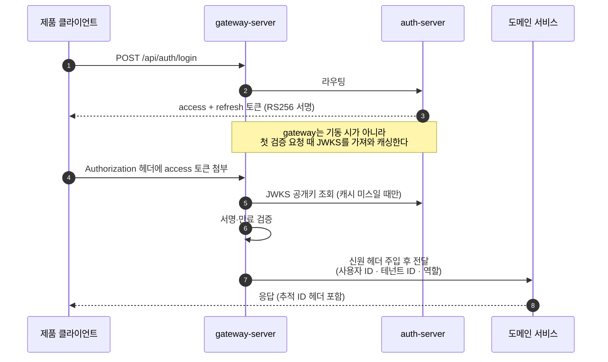
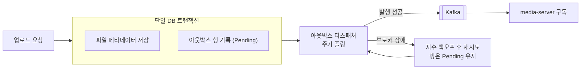
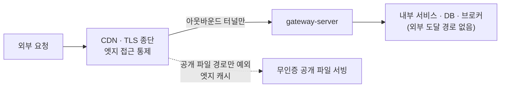

# 아키텍처

SSW Infra의 구조적 결정 여섯 가지를 "무엇을 · 왜 그렇게" 순서로 정리했습니다. 서비스별 역할은
[서비스 카탈로그](services.md)를, 이 결정들이 어떤 프로세스로 만들어졌는지는
[엔지니어링 프로세스](engineering-process.md)를 참고하세요.

---

## 1. 단일 진입점과 인증 위임

외부에서 인프라로 들어오는 트래픽은 **gateway 하나**만 지납니다. 나머지 서비스와 데이터 계층은
클러스터 내부 네트워크에만 존재하고, 외부에서 직접 도달할 수 있는 경로가 없습니다.

### 토큰 발급과 검증의 분리



- **서명 알고리즘은 RS256**, 공개키는 표준 **JWKS 엔드포인트**로 배포합니다. 대칭키(HS256)를 쓰면
  검증 주체마다 비밀키 사본이 생기지만, 비대칭키는 발급자만 개인키를 쥐고 검증자는 공개키만 가지면
  됩니다. 외부 제품이 소비자로 붙는 구조에서는 이 차이가 결정적입니다.
- **검증은 gateway 단독**입니다. 하위 서비스는 주입된 헤더를 신뢰하고 재검증하지 않습니다. 요청마다
  서명 검증을 N번 반복하지 않아 지연이 줄고, 인증 로직이 한 곳에만 존재해 변경 지점이 하나입니다.
- 대신 **이 모델의 안전 조건은 네트워크 격리**입니다. gateway를 우회해 하위 서비스에 직접 도달할 수
  있으면 헤더 위조가 곧 인가 우회가 됩니다. 그래서 "하위 서비스 포트 외부 미노출"을 배포 게이트
  체크리스트의 필수 항목으로 올려 두었고, 단일 호스트 전제가 깨지는 토폴로지로 확장할 때는 서명 헤더
  또는 mTLS를 재검토하기로 결정 근거와 함께 기록해 두었습니다.

### 서버 간 인증은 별도 트랙

사람 요청과 서버 요청은 다른 경로를 씁니다. 서버 간 호출에는 client credentials 방식의 **서비스 토큰**을
쓰고, 이 토큰에는 호출자 식별자 · 대상 서버(`aud`) · 토큰 타입이 담깁니다. 수신 측은 서명뿐 아니라
**대상(`aud`) 일치까지** 확인합니다 — 서명은 유효하지만 다른 서버용으로 발급된 토큰은 거부됩니다.
클라이언트 시크릿은 서버가 난수로 생성해 응답에서 1회만 평문 노출하고, 저장은 해시로만 합니다.

### 관리 콘솔 패턴

gateway가 토큰의 테넌트 클레임을 헤더로 **고정 재주입**하므로, 헤더로는 호출자 자신의 테넌트만 표현할
수 있습니다. 즉 헤더만으로는 다른 테넌트를 조회 대상으로 지정할 수 없습니다. 오너가 임의 테넌트를
들여다봐야 하는 관리 콘솔 화면만 예외적으로 대상 테넌트를 경로·쿼리 파라미터로 명시하도록 허용하되,
**그 파라미터를 신뢰하기 전에 중앙 운영자 역할 보유 여부를 반드시 검증**하는 규칙을 규약으로 고정했습니다.

---

## 2. 이벤트 드리븐 — 브로커 부재 내성까지

서비스 간 통신은 두 갈래뿐입니다. 요청/응답이 필요하면 동기 HTTP, 부수 흐름이면 비동기 이벤트입니다.
그리고 **어떤 서비스가 어떤 서비스를 호출해도 되는지를 의존성 매트릭스로 고정**해, 매트릭스에 없는
호출은 금지합니다. 새 의존이 필요하면 코드보다 문서를 먼저 바꿉니다.

### 아웃박스 — "브로커가 없어도 유실되지 않는다"

파일 업로드를 예로 들면, 업로드 처리와 이벤트 발행이 서로 다른 시스템(DB · 브로커)에 걸쳐 있습니다.
둘 중 하나만 성공하면 데이터가 어긋납니다.



이벤트를 **DB 트랜잭션 안에서 아웃박스 테이블에 먼저 쓰고**, 별도 디스패처가 그것을 읽어 발행합니다.
브로커가 죽어 있으면 행이 Pending으로 남을 뿐 업로드 자체는 정상 완료되고, 브로커가 복귀하면 밀린
이벤트가 **소급 발행**됩니다. 실제로 브로커를 나중에 투입했을 때 그동안 쌓여 있던 업로드 이벤트가
한꺼번에 흘러 파생본이 소급 생성되는 것을 라이브에서 확인했습니다.

### DLT — 실패를 삼키지 않고 격리

- 모든 비즈니스 토픽에 `<원본 토픽>.DLT`를 하나씩 둡니다.
- DLT 값은 **원본 envelope를 그대로 보존**하고, 원본 토픽·파티션·오프셋·재시도 횟수·실패 코드는
  Kafka 헤더에 남깁니다. 재처리에 필요한 정보를 잃지 않기 위해서입니다.
- **DLT 발행이 실패하면 원본 오프셋을 커밋하지 않습니다.** "실패했다는 사실조차 잃어버리는" 경로를
  막는 장치입니다.
- 발행측 자신의 전송 실패는 DLT 대상이 아닙니다 — 그건 아웃박스와 유한 재시도의 몫입니다. 두 장치의
  책임 경계를 명시적으로 갈라 두었습니다.

### 이벤트 스키마 정본 관리

이벤트 계약은 **JSON Schema + 유효/무효 fixture + 매니페스트**가 정본이고, 브로커 저장소는 스키마 사본을
갖지 않습니다(런타임 토픽 구성만 소유). 토픽 명명은 `<도메인>.<사건>`(예: `file.uploaded`,
`media.processed`, `notify.request`, `log.entry`)이고, envelope에는 이벤트 ID · 발생 시각 · 테넌트 ·
추적 ID · 발행자 · payload가 들어갑니다.

전제는 **at-least-once**입니다. 구독측은 이벤트 ID로 멱등 처리해야 하고, 자기가 발행한 이벤트를 다시
소비하는 루프는 발행자 표시로 걸러냅니다(미디어 파이프라인에서 실제로 필요했던 장치입니다).

---

## 3. 오류 계약 — RFC 9457 전 서비스 통일

초기에는 서비스마다 자기 오류 DTO를 갖고 있었고, 결과적으로 **클라이언트 입장에서 모든 실패가 한
종류로 보였습니다.** 무엇이 잘못됐는지 코드로 분기할 수 없었고, 요청 하나를 서버 여러 대에 걸쳐
따라갈 상관관계 키도 응답에 없었습니다.

이걸 표준 채택으로 해소했습니다. 자체 포맷을 만들지 않고 **RFC 9457 Problem Details**를
`application/problem+json`으로 씁니다.

```json
{
  "type": "<문제 유형 URI>",
  "title": "요청 검증 실패",
  "status": 400,
  "detail": "요청 값이 유효하지 않습니다.",
  "code": "VALIDATION_FAILED",
  "traceId": "<응답 헤더와 동일한 추적 ID>",
  "errors": [
    { "code": "REQUIRED", "detail": "필수 값입니다.", "pointer": "#/email" }
  ]
}
```

설계 포인트:

- **`code`는 기계 판독 분기 키**입니다. 공통 코드는 매니페스트에 등록된 것만 쓰고, 서비스가 임의로
  코드를 만들지 않습니다. 문제 유형 URI는 `기준 URI + 코드별 suffix`로 결정론적으로 만듭니다.
- **`traceId`는 응답 헤더와 반드시 같은 값**입니다. 로그·이벤트 envelope·스팬에 같은 값이 전파되므로,
  장애 협의 때 이 하나로 세 축을 교차 조회할 수 있습니다.
- 필드별 오류는 **RFC 6901 JSON Pointer**로 위치를 가리킵니다(`#/email`). 여기서도 자체 표기법을
  만들지 않았습니다.
- **5xx 응답에는 예외 메시지·스택·내부 호스트명·SQL·비밀값을 절대 넣지 않습니다.** "안전한 최소 응답"을
  golden fixture로 고정해 두고, 계약 검증 스크립트가 매니페스트·스키마·fixture 간 정합성을 교차 검사합니다.
- 추적 ID 헤더는 **앞뒤 공백(HTTP OWS)을 제거한 뒤** 허용 문자·길이를 검사합니다. 유효한 외부 값은
  보존하고, 없거나 유효하지 않으면 새로 발급합니다. RFC 9110상 OWS는 헤더 값의 일부가 아니라는
  근거까지 계약에 적어 두었습니다 — 이 한 줄이 없어서 언어별 구현이 미세하게 갈렸던 적이 있습니다.

이 통일은 **14개 저장소를 관통하는 한 번의 마이그레이션 웨이브**로 진행했습니다. 순서는
정본 매니페스트 → 언어별 생성물 → 관리 콘솔의 관대한 파서 선배포 → gateway → 저위험 서비스 → 인증
서비스 독립 반영 → 레거시 제거였고, 각 단계는 독립된 검증 세션이 판정했습니다.

---

## 4. 폴리글랏 + 공용 계약 라이브러리

언어는 서비스 성격에 맞게 고르되(**Java 서비스 6종 / .NET 서비스 6종 / Node 앱 1종**), 언어를 고르면
프레임워크·빌드 툴·테스트 도구 세트는 강제됩니다. 자유는 언어 선택까지고, 그 아래는 표준입니다.

문제는 **같은 계약을 두 런타임이 각자 구현하면 반드시 어긋난다**는 점입니다. 그래서 core 그룹에
Java·.NET **공용 계약 라이브러리**를 두고, 다음을 여기서 공급합니다:

- 이벤트 envelope 타입과 토픽별 payload 타입
- 오류 코드 열거형과 Problem Details 직렬화
- 추적 ID 생성·검증 유틸리티
- 공통 보안 컨텍스트 타입

정본은 언어 중립적인 **JSON Schema · 매니페스트 · fixture**이고, Java/.NET 구현은 그것의 산출물입니다.
계약을 바꿀 때는 정본 → 두 언어 구현 → 소비 서비스를 **같은 작업 단위에서** 함께 검증합니다.

이 규율이 실제로 작동한 사례가 있습니다. 어떤 웨이브에서 브리핑에 적힌 이벤트 payload 형태와 정본
스키마가 어긋난 적이 있는데, "정본은 항상 core의 스키마"라는 원칙이 있어 브리핑이 아니라 스키마를
따르는 것으로 즉시 정리됐습니다. 정본이 어디인지 미리 못 박아 두지 않았다면 두 런타임이 서로 다른
형태로 구현됐을 겁니다.

라이브러리 카탈로그를 별도 문서로 유지하며 **버전·세대 불일치를 드러내는 것 자체를 목적**으로
운영합니다(예: 특정 ORM이 아직 최신 런타임 호환 안정판을 내지 않아 폴백 운용 중인 상태를 이유와 함께
표에 남겨 둡니다).

---

## 5. 쿠버네티스 배포 — 로컬 검증 → 클라우드 재연

**같은 매니페스트로 로컬과 클라우드를 재현**하는 것을 전제로 썼습니다. 로컬은 kind(컨테이너 안에
쿠버네티스를 띄우는 방식)로 검증하고, 클라우드 VM에서 동일한 순서로 재연합니다. kind 전용 파일은
디렉터리 하나로 격리하고, 나머지 매니페스트에서 환경 의존적인 줄에는 주석으로 표시를 남겼습니다.

### 프로브를 "기동 필수 / 기능 필수"로 나눠 설계

가장 많이 배운 지점입니다. **프로세스가 떠서 프로브가 초록인데 정작 일은 못 하는 조합**이 존재합니다.
그래서 서비스별로 두 축을 따로 표로 정리했습니다.

| 유형 | 예 | 설계 |
|---|---|---|
| 의존성이 없으면 **기동 자체가 실패** | 마이그레이션이 기동 중 도는 서비스, 메일 발송 빈이 없으면 컨텍스트가 못 뜨는 서비스 | startupProbe로 느린 기동 구간을 보호 |
| 의존성이 없어도 **프로세스는 뜨고 readiness만 실패** | 브로커 구독 완료를 readiness 기준으로 삼은 워커 | Service 엔드포인트에서만 빠지고 재시작은 안 함 |
| 프로브는 통과하는데 **기능은 실패** | 레이트리미터 백엔드가 없는 게이트웨이, 테이블이 없는 상태로 접속만 확인하는 서비스 | 한계를 문서에 명시하고 배포 체크리스트로 승격 |

헬스 엔드포인트는 프레임워크 기본 액추에이터에 기대지 않고 **공통 규약(`/healthz` · `/readyz`)으로
직접 구현**했습니다. 두 엔드포인트는 인증 불필요이고 레이트리밋에서 제외합니다.

### 리소스 예산을 실측으로 운영

작은 VM 하나에 스택 전체를 얹는 것이 목표였기 때문에, 워크로드마다 CPU·메모리 request/limit을 잡고
**JVM 힙 상한을 컨테이너 limit과 함께** 겁니다. limit만 걸고 힙을 안 잡으면 JVM이 limit을 모른 채
힙을 키우다 OOM으로 죽기 때문입니다(.NET은 cgroup limit을 읽어 스스로 잡으므로 이 장치가 필요 없습니다).

CPU request는 **실측 기반으로 하향**했습니다. 유휴 상태 실사용이 예약치에 한참 못 미치는 걸 확인하고
전 워크로드 request를 내려, 서비스를 둘 더 얹고도 스케줄러 여유가 오히려 늘어난 상태로 만들었습니다.
CPU limit은 일부러 걸지 않습니다 — 걸면 기동 중 JIT 워밍업 구간에서 스로틀링이 나 startupProbe가
오탐하기 쉽습니다.

### 스테이트풀 vs 스테이트리스를 이유로 구분

- **StatefulSet은 DB와 브로커만.** 둘 다 디스크에 쌓인 데이터가 곧 정체성이라, 파드가 죽었다 살아날 때
  *같은 디스크*를 다시 잡아야 합니다. 특히 브로커 로그에는 **아직 아무도 소비하지 않은 이벤트**가 있고
  발행측은 발행 성공한 이벤트를 아웃박스에서 지우므로, 브로커가 로그를 잃으면 재발행해 줄 원본이 어디에도
  없습니다.
- **파일 서비스는 PVC를 쓰지만 Deployment**입니다. 원하는 건 "파드마다 각자 볼륨"이 아니라 "하나의 볼륨
  공유"이기 때문입니다. 대신 RWO 볼륨이라 신·구 파드가 동시에 붙을 수 없어 롤아웃 전략을 Recreate로 뒀습니다.
- **replicas 1의 이유가 서비스마다 다릅니다.** DB는 증설 금지(파드를 늘려도 복제 클러스터가 되지 않고
  서로 모르는 DB 두 개가 생길 뿐), 실시간 채팅은 백플레인이 없어 증설 불가(파드가 둘이면 서로 다른 파드에
  붙은 클라이언트끼리 메시지가 안 감), 나머지는 스테이트리스라 증설 가능하지만 예산상 선택입니다.
  **"금지"와 "안 한 것"을 구분해 기록**해 두면 나중에 늘릴 때 판단이 빠릅니다.

### 클라우드 이전 시 바뀌는 것을 미리 표로

DB를 관리형으로 옮기는 경우를 대비해, 앱은 **DB Service 이름 하나만** 바라보게 하고 그 이름 뒤에
무엇을 놓는지를 두 변형(클러스터 내부 StatefulSet / 클러스터 외부 엔드포인트)으로 갈라 두었습니다.
**앱 매니페스트는 두 경우에 완전히 동일**합니다 — 앱은 DB가 클러스터 안에 있는지 밖에 있는지 알 필요가
없습니다. 이미지 주소·시크릿 공급 방식·StorageClass·브로커 운영 형태 등 이전 시 바뀌는 항목도
"무엇을 · 어디서 · 왜"로 표에 정리해 두었습니다.

---

## 6. 노출 통제 — 인바운드 포트를 열지 않는다



- **TLS는 엣지에서 종단**하고, 호스트는 **인바운드 포트를 하나도 열지 않습니다.** 터널이 아웃바운드로
  연결을 맺는 방식이라 공인 IP도 노출되지 않습니다.
- **비공개 API는 출처 기반 접근 통제**를 엣지에서 겁니다. 최종 사용자는 인프라 도메인을 직접 호출하지
  않고, 소비 제품의 백엔드가 프록시합니다 — 이 구조가 출처 제한을 성립시키는 조건입니다.
- **공개 파일 경로만 전 세계 무인증 공개**로 예외 처리하고 CDN이 캐시합니다. 대신 **삭제된 파일의 구
  URL이 엣지 캐시에 수 시간 잔존**할 수 있다는 점을 실측으로 확인해 소비자 계약에 명시했습니다.
  그래서 이미지 교체는 "새로 업로드 → 참조 전환 → 구 파일 삭제" 순서를 규약으로 정해, 사용자 관점의
  404 창이 생기지 않게 했습니다.
- API 문서(OpenAPI)는 외부 인터넷에 노출하지 않고 내부망·관리 콘솔에서만 접근합니다.
