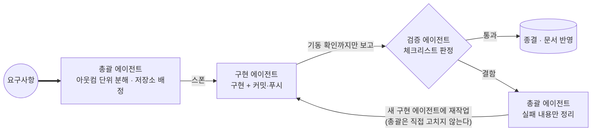

# 엔지니어링 프로세스

SSW Infra는 **한 명의 엔지니어와 여러 AI 에이전트 세션**이 함께 만든 시스템입니다. 17개 저장소를
동시에 다루면서 품질을 유지하려면 "AI에게 시킨다"로는 부족하고, **역할 분리와 검증 게이트를 갖춘
프로세스**가 필요했습니다. 이 문서는 그 프로세스와, 그것이 실제로 무엇을 잡아냈는지를 정리합니다.

---

## 1. 역할 분리 — 구현자는 자기 결과를 판정하지 않는다



세 역할이 각자 **할 수 없는 것**으로 정의됩니다.

| 역할 | 하는 일 | **하지 않는 일** |
|---|---|---|
| 총괄 | 요구사항 해석, 아웃컴 단위 태스크 분해, 저장소 배정, 검증 오케스트레이션, 의사결정 | 코드를 직접 고치지 않는다 |
| 구현 | 단일 저장소 범위의 구현과 커밋 | **요구사항 충족 여부를 판정하지 않는다** — 보고는 "코드가 기동하는가"까지 |
| 검증 | 체크리스트 기준 판정 | **코드를 고치지 않는다** — 실패 내용만 돌려보낸다 |

### 왜 이렇게까지 나눴나

한 세션이 자기 코드를 검증하면 **구현할 때 한 착각을 검증에서도 그대로 반복합니다.** 자기가 테스트를
"통과하도록" 만든 사람이 그 테스트가 옳은지 판단할 수는 없습니다.

그래서 두 가지를 강제합니다.

- **구현 세션의 자체 확인 결과는 검증 브리핑에 넣지 않습니다.** 넣으면 검증이 그 결론을 따라갑니다.
  검증은 "구현자가 뭘 확인했는지" 모른 채 체크리스트만 보고 시작합니다.
- **검증에서 실패가 나오면 검증 세션이 고치지 않고, 총괄도 고치지 않습니다.** 실패 내용만 정리해
  새 구현 세션에 재작업시키고, 돌아오면 **같은 체크리스트로 전체 재검증**합니다 — 수정이 다른 항목을
  깨뜨렸을 수 있으니까요.

다만 무한정 나누지는 않습니다. **검증 항목이 서넛에 그치는 작은 작업은 한 세션에 묶습니다** — 왕복
비용이 분리로 얻는 것보다 크기 때문입니다. 언제 나누고 언제 묶는지의 기준도 문서로 고정돼 있습니다.

### 역할에 맞춰 모델을 고른다

- **구현은 상위 추론 모델**, **정해진 절차의 판정은 경량 모델**을 씁니다.
- 단, **"뭘 고쳐야 할지 찾는 것부터 시작하는 작업"(조사·디버깅)은 검증 성격이라도 상위 모델**로 올립니다.
- 반대로 **판단이 필요 없는 기계적 작업**(스윕·카운트·정해진 배치)은 역할과 무관하게 경량 모델입니다.
- **경량 모델에 판정을 맡기려면 확인 항목과 판정 기준이 절차로 적혀 있어야 합니다.** 검증 시나리오는
  위임 **전에** 총괄이 설계해 브리핑에 담습니다. 이 규칙이 없으면 "잘 된 것 같다"는 보고만 돌아옵니다.

되돌리기 어려운 결정(파일 삭제·데이터 변경·자격증명·외부 발신·배포·과금)은 **모델과 무관하게**
브리핑에 없으면 하지 않고 사람에게 올립니다.

---

## 2. 파일 기반 메시지 프로토콜 — 이기종 AI 환경을 잇는 방법

에이전트 환경이 하나가 아닙니다. 서로 다른 벤더의 AI 도구가 각자의 세션으로 참여하는데, 이들 사이에는
공유 메모리도 공용 API도 없습니다.

해법은 **파일시스템 자체를 메시지 버스로 쓰는 것**이었습니다.

```
inbox/
  <세션>/          ← 수신함 루트 = 미접수 신규
    working/       ← 접수·처리 중
    done/          ← 처리 완료
```

프로토콜은 세 단계입니다.

1. **보내기** — 발신자가 *수신자의* 수신함 루트에 마크다운 파일을 만든다.
2. **접수** — 수신자가 그 파일을 자기 `working/`으로 옮긴다. **옮기는 행위 자체가 ack**다.
3. **완료** — `working/` → `done/`으로 옮긴다. 회신이 필요하면 상대 수신함에 **새 파일**을 만든다.

규칙 몇 가지가 이 구조를 유지합니다.

- **남의 수신함에서는 파일 생성만** 한다. 이동·수정·삭제는 수신함 주인만 한다.
- **보낸 파일은 수정하지 않는다.** 정정·추가는 항상 새 메시지로 한다 — 메시지가 사후에 바뀌면 무엇에
  합의했는지가 사라진다.
- 날짜는 항상 절대 표기로 쓴다. "어제", "다음 주" 같은 상대 표현은 금지 — 세션은 자기가 언제 실행되는지
  모른다.
- 태스크 메시지에는 수신자가 맨땅에서 시작하지 않도록 관련 문서·저장소·파일 경로를 명시한다.
- 바이너리·대용량 산출물은 수신함에 넣지 않고 별도 공유 폴더에 매니페스트와 함께 둔다. **매니페스트
  없는 파일은 없는 셈** 친다.

보드도, 칸반도, 폴링 루프도 없습니다. **파일 하나가 곧 상태**이고, 그래서 어떤 도구를 쓰는 세션이든
참여할 수 있습니다.

일회성 서브에이전트는 이 수신함을 쓰지 않고 **자기를 띄운 세션에 직접 보고**합니다 — 대표 세션만
수신함으로 소통하게 해서 채널이 난립하지 않게 했습니다.

---

## 3. 계약 우선 개발

멀티레포 + 폴리글랏 조합에서 가장 자주 깨지는 것은 코드가 아니라 **서비스 사이의 합의**입니다.
그래서 이 프로젝트에서는 **계약이 코드보다 먼저이고, 계약의 정본이 어디인지를 못 박아 둡니다.**

- **오류 계약**: 코드 매니페스트 + JSON Schema + golden fixture가 정본. 서비스가 임의로 오류 코드를
  만들지 않습니다.
- **이벤트 계약**: envelope·토픽별 payload JSON Schema + 유효/무효 fixture가 정본. 브로커 저장소조차
  스키마 사본을 갖지 않습니다.
- **외부 소비자와의 계약**: 소비 제품과의 인증·파일 위임은 **버전이 붙은 계약 문서**로 박제합니다.
  토큰 클레임 하나하나의 타입과 존재 보장, TTL과 회전 시맨틱, 오류 코드별 의미, 장애 시 동작까지
  적습니다.

이 규율이 실제로 작동한 순간이 있습니다. 한 웨이브에서 **총괄이 브리핑에 적은 이벤트 payload 형태가
정본 스키마와 어긋난** 적이 있는데, "이벤트 계약은 반드시 core의 스키마가 정본"이라는 규칙이 있어
브리핑이 아니라 스키마를 따르는 것으로 즉시 정리됐습니다. 정본을 미리 정해 두지 않았다면 두 런타임이
서로 다른 형태로 구현됐을 겁니다. **지시보다 계약이 위에 있어야 한다**는 걸 배운 사례입니다.

계약을 바꿀 때는 **스키마 → 언어별 구현 → 소비 서비스**를 같은 작업 단위에서 함께 검증합니다.

---

## 4. 실측 검증 문화

### 자동 테스트는 게이트, 실측은 판정

- 수평 코드 점검 웨이브에서 **15개 저장소 644건의 자동 테스트를 게이트로 통과**시키고, 통합 테스트는
  머신 부하를 고려해 순차 실행하는 규칙까지 절차에 넣었습니다.
- 미디어 파이프라인 수리 웨이브에서는 두 서비스에 각각 **129건 · 65건**의 회귀 테스트를 붙였습니다.
- 다만 자동 테스트 통과를 최종 판정으로 삼지 않습니다. **라이브 도메인을 경유한 E2E 실측**으로 닫습니다.
  파일 위임 계약을 확정할 때도 서비스 토큰 발급 → 업로드 → 처리 상태 폴링 → 파생본 조회 → 파생본 직접
  삭제 거부 → 원본 삭제 → 재삭제 404 → 기존 자산 무영향까지 **전 구간을 실제 공개 경로로** 확인하고
  그 결과를 계약 문서에 실측 기록으로 남겼습니다.

### "통과 ≠ 동작"을 계속 의심한다

프로세스에 박힌 교훈 중 값비쌌던 것들:

- **"빌드 통과 ≠ 기동 가능"** — 프레임워크 메이저 업그레이드에서 자동구성 모듈이 갈라지자 빌드는
  멀쩡한데 컨텍스트 로드가 실패했습니다. 대응으로 전 Java 저장소에 컨텍스트 로드 테스트를 도입했습니다.
- **"E2E 통과 ≠ 실배선"** — 목업 데이터가 그럴싸하게 렌더링되면 오류 없이 통과합니다. 실제로 API
  클라이언트를 import조차 하지 않은 화면이 E2E를 통과한 적이 있습니다. 그 뒤로 화면 검증 기준은
  "에러 없음"이 아니라 **"데이터 출처까지 확인"** 입니다.
- **"프로브 초록 ≠ 기능 정상"** — 헬스 엔드포인트가 의존성을 안 보면, 레이트리미터 백엔드가 없거나
  테이블이 없는 상태로도 초록이 뜹니다. 그래서 배포 문서에 서비스별 "기동 필수 / 기능 필수"를 두 칸으로
  나눠 적고, 프로브가 못 보는 것을 명시했습니다.
- **환경 실패와 코드 결함을 구분한다** — 권한·포트 점유·컨테이너 미기동처럼 머신 사정으로 실패한 건
  코드 결함이 아니므로 재시도 조합에 시간을 쓰지 않고 사유와 함께 스킵으로 표기하고 진행합니다.

### 사후 기록을 지식으로 박제

종결된 사건은 **비난 없는 회고(blameless)** 원칙으로 기록합니다. 필수 섹션은 사건 개요 · 타임라인 ·
**5 Whys로 파고든 근본 원인** · 대응 과정 평가 · 실행 계획이고, "누가 실수했나"가 아니라 **"무엇이
이 실수를 가능하게 했나"** 를 묻습니다. 개별 문서를 쓸 규모가 아닌 것은 별도의 교훈 모음에 한 줄씩
누적하다가, 재발하면 정식 사후 기록으로 승격합니다.

커밋 전에 시크릿·내부 호스트·실사용자 데이터를 걷어내는 것도 규칙에 포함돼 있습니다 — **git 히스토리에
한 번 들어간 시크릿은 지워도 남기 때문에** 커밋 전에 거르는 것이 유일한 방법입니다.

---

## 5. 실사례

### 사례 A — 인증 위임의 무개입 폴백 강등과 복귀

소비 제품(이커머스 데모)의 로그인을 이 인프라의 auth-server로 위임하면서, 계약서에 **장애 정책**을
먼저 못 박았습니다: 인프라 인증이 불통이면 소비 측은 **로컬 폴백으로 로그인을 유지**하고, 화면에
폴백 모드임을 표시한다.

이 조항은 곧 실전에서 검증됐습니다. 인프라 호스트에서 컨테이너 런타임 세션이 정리되며 클러스터
노드가 내려간 장애가 발생했고, 그동안:

- 소비 제품의 **라이브 로그인은 계속 200**을 반환했습니다.
- 응답의 인증 모드 필드가 **`infra` → `fallback`으로 자동 강등**됐습니다.
- 인프라가 복구되자 **같은 호출이 다시 `infra`(비대칭키 서명)로 복귀**했습니다.

**사람의 개입은 한 번도 없었고, 차단된 사용자는 0명**이었습니다. 원인은 세션 종료 시 사용자 프로세스가
정리되는 설정이었고, 세션과 무관하게 유지되도록 조치해 재발을 막았습니다.

여기서 얻은 것은 "장애가 없었다"가 아니라 **"장애 정책을 계약에 먼저 쓰면, 장애가 실제로 왔을 때
그 조항이 사양대로 동작하는지 관찰할 수 있다"** 는 점입니다. 그 관찰 결과를 계약 문서에 실전 검증
기록으로 되돌려 적었습니다.

### 사례 B — 미디어 파이프라인 소급 처리

상품 이미지를 정적 자산에서 파일 서비스 소유로 옮기는 작업이었습니다. 착수 전 조사에서 결함 여러 개가
한꺼번에 드러났습니다 — 파일 서비스가 WebP를 허용하지 않아 파생본 저장을 거부하고, 미디어 서비스가
존재하지 않는 응답 필드를 읽어 파생본 URL이 항상 빈 문자열이 되며, 무엇보다 **파생본이 만들어져도
소비자가 그 URL을 알아낼 경로가 아예 없었습니다.**

발견된 결함을 심각도로 나눠, 즉시 수정 대상과 "지금 조건에서는 발현하지 않으니 보류"를 구분해
기록한 뒤 수리 웨이브를 진행했습니다.

- 파생본 매핑을 소유할 주체를 정하고(파일 서비스가 처리 완료 이벤트를 구독해 매핑을 저장),
  **공개 조회 API를 신설**해 소비자가 파생본을 얻을 정식 경로를 만들었습니다.
- 파생본 저장 자체가 다시 업로드 이벤트를 낳아 무한 루프가 되는 문제는 **발행자 식별로 자기 이벤트를
  걸러내는** 장치로 막았습니다(라이브에서 실제로 100건 이상의 스킵이 관측됐습니다).
- 그리고 아웃박스 덕분에, 브로커를 투입하자 **이미 올라가 있던 시드 이미지 전량의 파생본이 소급
  생성**됐습니다. DLT로 떨어진 건 하나도 없었습니다.

효과는 실측으로 확인했습니다 — **상품 상세 이미지가 약 97% 경량화**됐습니다(원본 서빙 → WebP 파생본).
목록은 썸네일, 상세는 최적화본, 실패 시 원본으로 내려가는 강등 체인까지 소비 측 정책으로 정리했습니다.

배포 순서에서도 교훈이 나왔습니다. **구독자(파일 서비스)를 먼저 롤아웃하고 발행자(미디어 서비스)를
나중에** 적용해야 백로그를 소비하는 도중 구독자가 내려가지 않습니다. 이 순서를 문서에 남겼습니다.

---

## 6. 요약 — 이 프로세스가 지키려는 것

| 원칙 | 구체적 장치 |
|---|---|
| 자기검증 맹점 차단 | 구현·검증 세션 분리, 구현자의 자체 확인 결과는 검증 브리핑에서 제외 |
| 판단 주체 명확화 | 총괄은 조율만, 구현은 기동 확인까지, 검증은 판정만 |
| 합의를 코드보다 위에 | 스키마·매니페스트·fixture가 정본, 지시보다 계약 우선 |
| 이기종 도구 협업 | 파일시스템 기반 3단계 메시지 프로토콜, 남의 수신함에는 생성만 |
| 통과의 함정 회피 | 빌드·E2E·프로브 각각의 "통과 ≠ 동작" 사례를 절차에 반영 |
| 지식의 축적 | 비난 없는 회고, 5 Whys, 재발 시 교훈 → 정식 사후 기록 승격 |
| 되돌릴 수 없는 것은 사람에게 | 삭제·자격증명·외부 발신·배포·과금은 모델 무관하게 에스컬레이션 |
